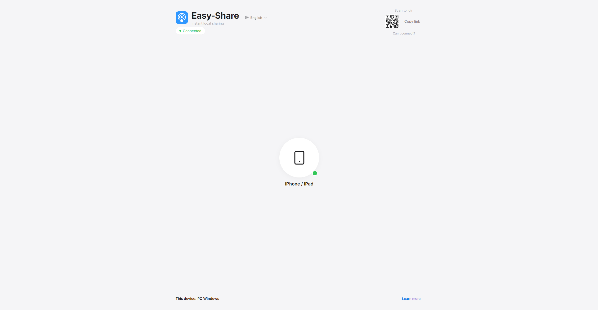

<div align="center">
  
  <h1>Easy-Share</h1>
  <p>A minimalist, local network file and text sharing utility.</p>
</div>

Allows quick transfers between devices (PCs, phones, tablets) connected to the same Wi-Fi network.



Supported platforms: Windows, Linux, macOS, Android, iOS.
Supported languages: English, Spanish, French, German, Italian, Portuguese.

## Running the Project

1. Install dependencies:

   ```bash
   pnpm install # or npm install
   ```

2. Start the local server:

   ```bash
   pnpm start # or npm start
   ```

3. Connect your devices:
   - On desktop, scan the QR code displayed in the top-right corner.
   - On mobile, tap the burger menu to show the QR code.

## Install globally on youyr system

To register the `easy-share` command globally and create a launcher shortcut directly on your desktop, run:

```bash
node install.js
```

After running the setup:

- **Desktop Shortcut**: Double-click the **Easy-Share** icon on your Desktop to start the server and open the web page automatically.
- **Global Command**: Type `easy-share` in any terminal window to start the server.

### Contributing

Contributions are welcome! If you have any ideas, suggestions, or improvements, please feel free to submit a pull request or open an issue.
(If you want to add a new language, please check the `public/translations` folder for existing translations and add your own.)
