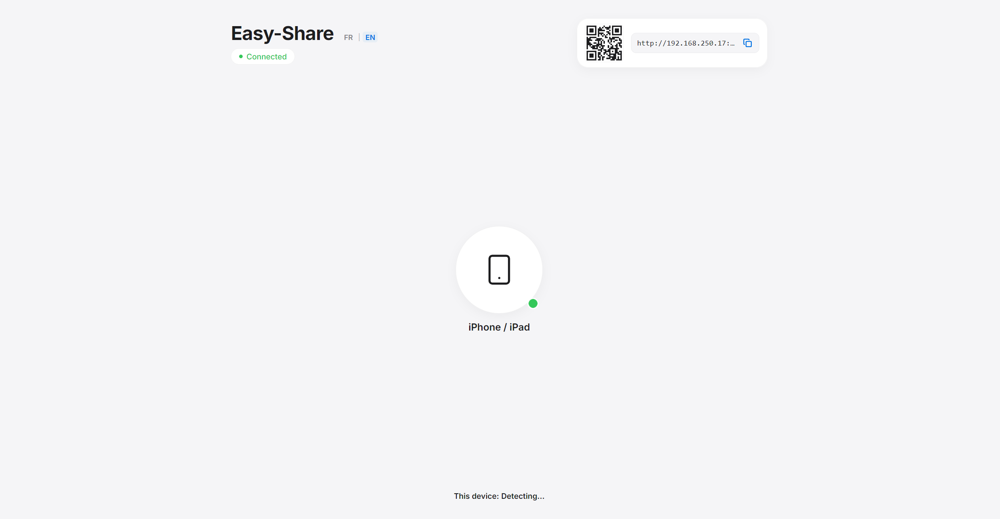

# Easy-Share

A minimalist, local network file and text sharing utility. Allows quick transfers between devices (PCs, phones, tablets) connected to the same Wi-Fi network.

## Running the Project

1. Install dependencies:

   ```bash
   pnpm install # or npm install
   ```

2. Start the local server:

   ```bash
   pnpm start # or npm start
   ```

3. Connect your devices:
   - On desktop, scan the QR code displayed in the top-right corner.
   - On mobile, tap the burger menu to show the QR code.


